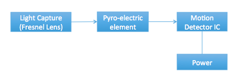
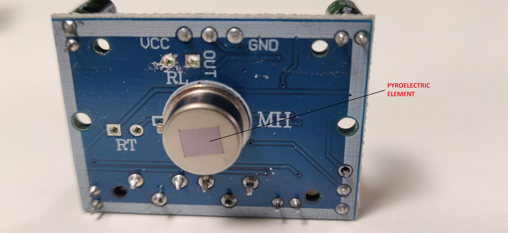
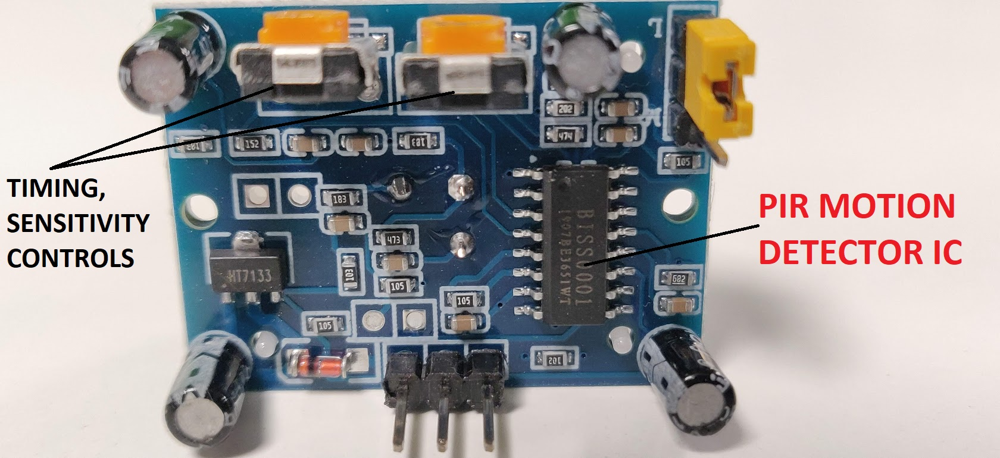
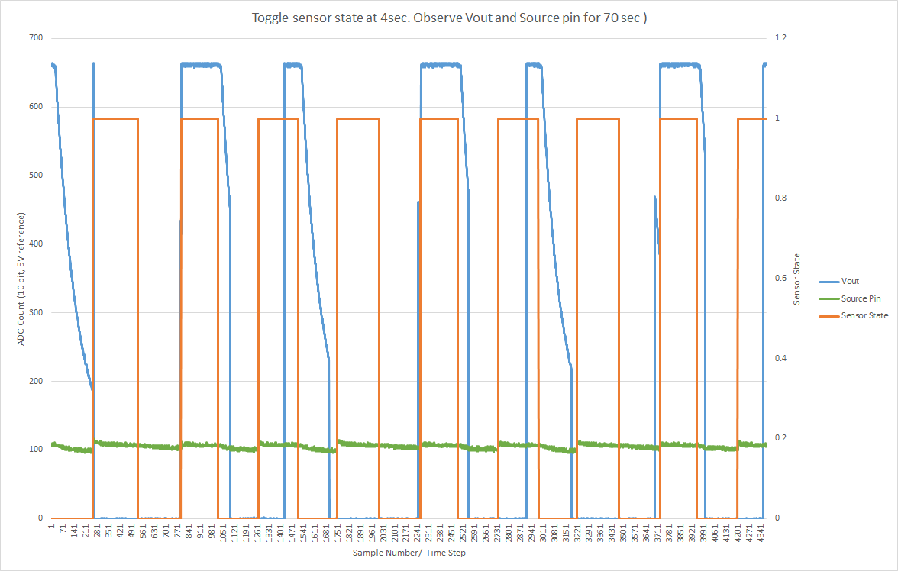
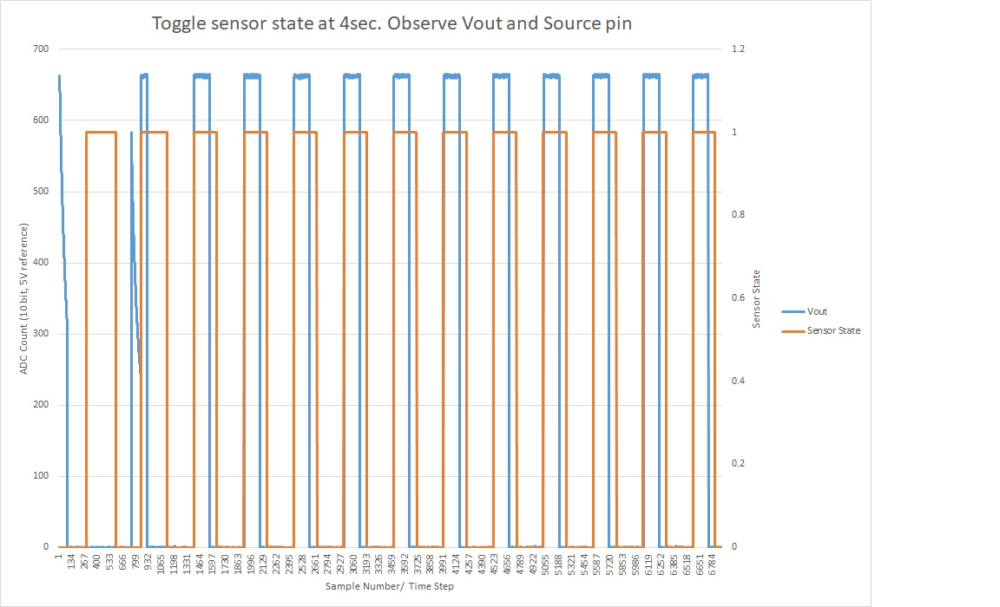
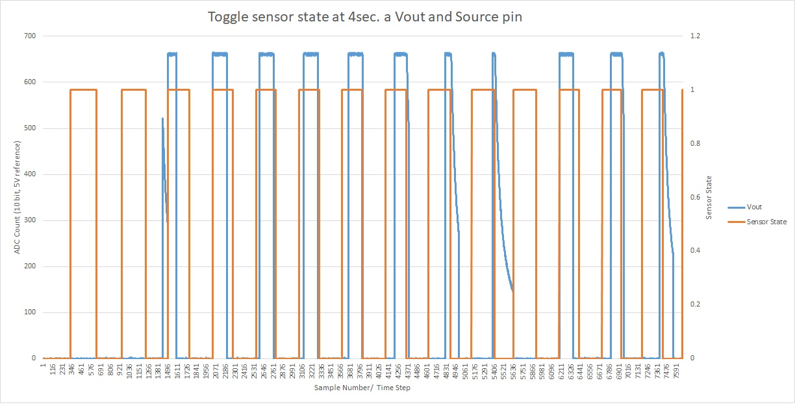
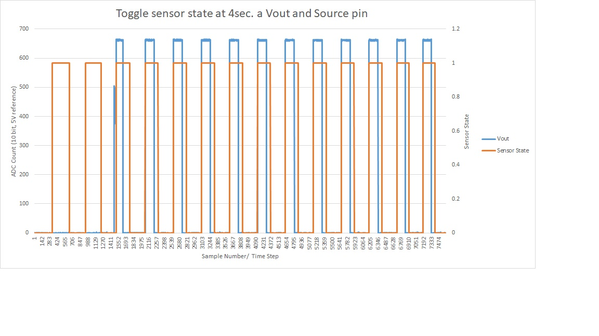
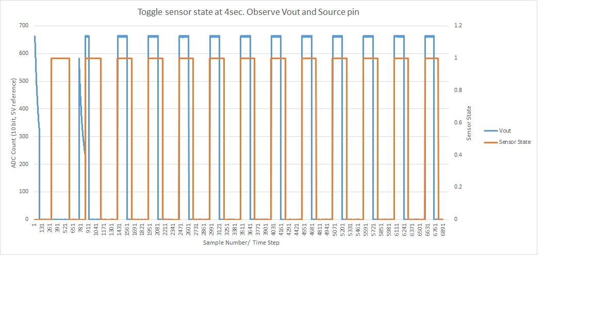
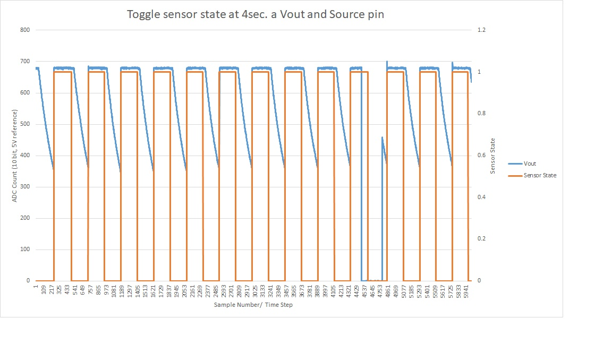
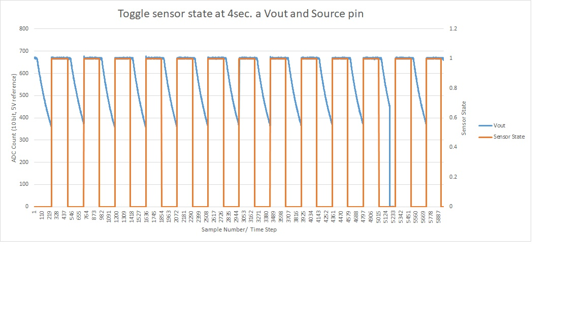

  

<h3 align="center">Internals of PIR Sensor Block</h3>

  
  
  
  
  

---

PIR Sensor is a Passive Infrared Sensor that detects the presence of humans or motion in the region of interest. 
They are also called "Pyroelectric" or "IR motion" sensors. The wavelength of IR that is sensed is usually around 10 μm. 
The sensor consists of a pyroelectric material, a Fresnel lens, and a Micro Power PIR Motion Detector IC. 
The board has supporting circuitry to configure the timing and sensitivity of the IC.

## 📝 Table of Contents
+ [Introduction](#intro)
+ [Physics of the Sensor](#physics)
+ [Block Diagram](#block_diagram)
+ [What can go wrong?](#fault_scenarios)
+ [How do we monitor these blocks?](#monitor)

## Introduction 
PIR sensors are commonly used to detect occupancy in smart buildings to achieve goals such as security and power savings.

## Physics of the Sensor 
PIR sensors work on the principle of pyroelectricity—voltage generation when heat is applied to a material.

## Block Diagram 

  

  

  

## What can go wrong? 
Faults can be due to:
+ Pyroelectric sensing element failure
+ PIR Motion detector IC failure
+ Damage to Fresnel lens

Data correctness can be affected by:
+ False positives due to differential noise

## How can we monitor the block? 
Current measurements in PIR sensor:

| Status        | Current Measured |
|---------------|-------------------|
| Working Part  | < 24 μA           |

---

## Questions
+ Can I say when an object is present, do we see a current at the output of the pyroelectric?
+ Properties of the pyroelectric element
+ Output for standard input
+ Turning on/off drain, what happens to source?
+ Vary drain, get some source, check Vout — assume constant environment, high sampling
+ Find what types of PIR sensors are on the market
> What are the different ways the sensors fail?

## Common Causes of False Alarms in PIR
**Source:** [ACT Meters - Five Causes of PIR False Alarms](https://www.actmeters.com/advice/five-causes-of-pir-false-alarms/)

+ Low or unstable voltage at the detector.
+ Sudden infrared movement/heat changes.
+ White light momentarily blinding the detector.
+ Direct draught striking the detector.
+ RFI/EMI signals from mobile phones or other devices.

## Initial Experiments
+ **Current-based testing:** Low current (< 25 μA) — unreliable.
+ **Pyroelectric element testing:** Pulse at drain, look at source. Vary PWM duty cycle and voltage at drain, observe source voltage.
+ **Retriggering/non-retriggering modes:** Capture Vout.
+ **Warm-up behavior study:** Vout, Source, and heating/cooling tests.

---

## Warm-up Behavior Observations

  

<i>Observations:</i> Warm-up behavior without obstruction shows different characteristics from other modules — both Source and Vout observed.

  

<i>Observations:</i> Vout spikes each time the sensor is turned on.

  

<i>Observations:</i> Heated pyro element at 400°C for ~1 min results in increased response delays.

  

<i>Observations:</i> Behavior reverts to normal after natural cooling.

  

<i>Observations:</i> Another sensor confirms similar behavior.

  

<i>Observations:</i> Different waveform — decaying Vout after switching off.

  

<i>Observations:</i> Similar to previous—confirmation of behavior.

---

- Compare working & non-working behaviors of PIR sensors.
- Check Vout and output from the BISS0001 IC (pin 2).

| What to Fail            | How to Fail                     | Verify Failure | Quantity to Monitor | Is There a Change? |
|-------------------------|---------------------------------|----------------|----------------------|--------------------|
| Pyroelectric Element    | Heating one leg of the element  | ?              |                      |                    |

---

### List of Experiments Planned After Team Meeting

First, we characterize the working sensors. We look at Vout and later at source voltage:

+ Vout as a function of distance

